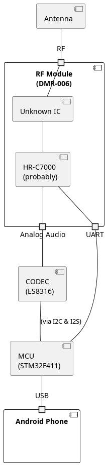
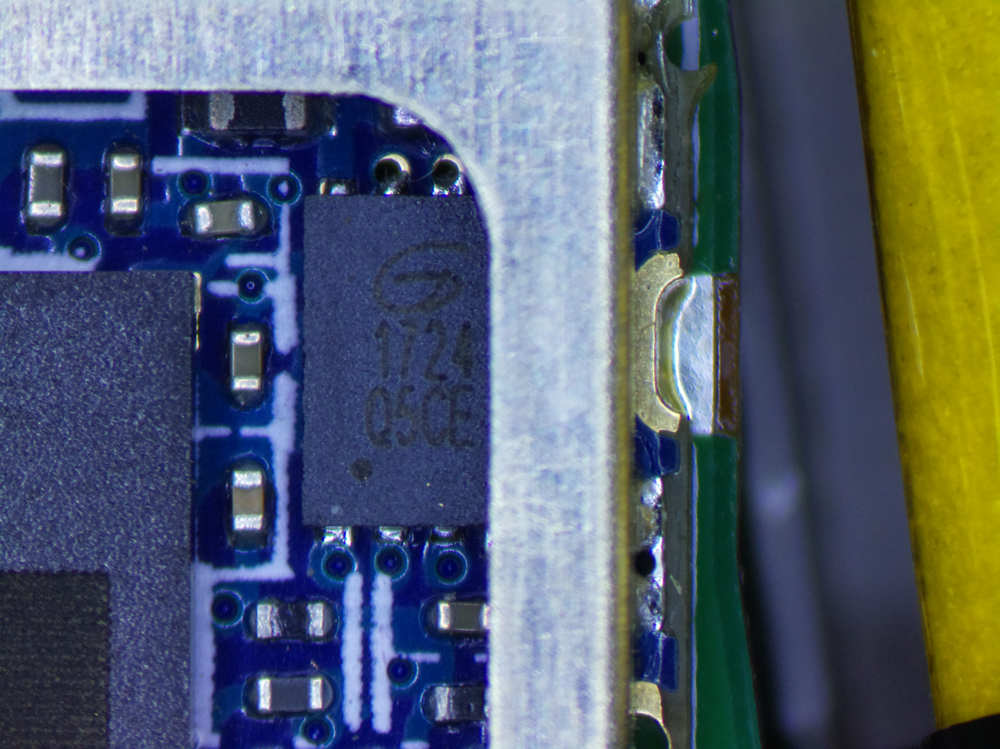

# Android

- root via https://topjohnwu.github.io/Magisk/install.html
- Intercom app needs native service to talk to hardware
  - see https://github.com/ad1217/M17_Intercom for an example app that uses the native service

# Hardware

## Block diagram

[generated with plantuml](./images/block-diagram.puml)

## Internal Photos

- [Atom XL](./docs/internal-Photo-4760397.pdf) [[Source](https://fccid.io/2AK6CATOMXL/Internal-Photos/internal-Photo-4760397.pdf)]
- [Atom L, showing unpopulated pads](./docs/internal-Photo-4733669.pdf) [[Source](https://fccid.io/2AK6CATOML/Internal-Photos/internal-Photo-4733669.pdf)]
  - the Atom L seems to be the exact same hardware, other than the RF components

## Microcontroller

- See [command-format.md](./command-format.md) for the commands sent to the MCU.

### is an STM32F411CEU6, from FCC ID photos

- [product page](https://www.st.com/en/microcontrollers-microprocessors/stm32f411ce.html)
- [datasheet](https://www.st.com/resource/en/datasheet/stm32f411ce.pdf)
- [reference manual](https://www.st.com/resource/en/reference_manual/rm0383-stm32f411xce-advanced-armbased-32bit-mcus-stmicroelectronics.pdf)

### Flashing via `dfu-util`

- android service calls `/vendor/bin/auto_update` shell script
- ...which uses `/system/bin/extcmdtest` to put it into DFU mode

### uses STM32Cube HAL, 1.5.0 <= version <= 1.14.0

- 1.2.0 adds STM32F411
- 1.5.0 adds `HAL_I2S_DMAPause` and `Resume`, which exist in firmware
- 1.15.0 changes `HAL_I2S_Init` to not match disassembly

### CODEC chip is Everest Semiconductor ES8316:

- [official datasheet](./docs/ES8316%20PB.pdf) [[Source](http://everest-semi.com/pdf/ES8316%20PB.pdf)]
- [datasheet with registers](./docs/es8316_user_guide.pdf) [[Source](https://forum.pine64.org/attachment.php?aid=1935)]

## RF Module (DMR-006)

- [Product Page](http://www.hhttalk.com/en/product_show.asp?pageid=115&big_id=67) (lacking any useful information)
- See [command-format.md](./command-format.md) for the commands sent to the DMR module, via the MCU
- inconveniently filters recieved audio (and maybe transmitted, untested)

### IC in RF Module (assuming it actually is a HR-C7000, which may or may not be accurate)

- uses a C-SKY CK803S
  - [C-SKY Ghidra module](https://github.com/leommxj/ghidra_csky)
  - [C-SKY Architecture user guide](https://github.com/c-sky/csky-doc/blob/master/CSKY%20Architecture%20user_guide.pdf)

#### Flash IC

- made by GigaDevice
- maybe a GD25LQ05C ?
