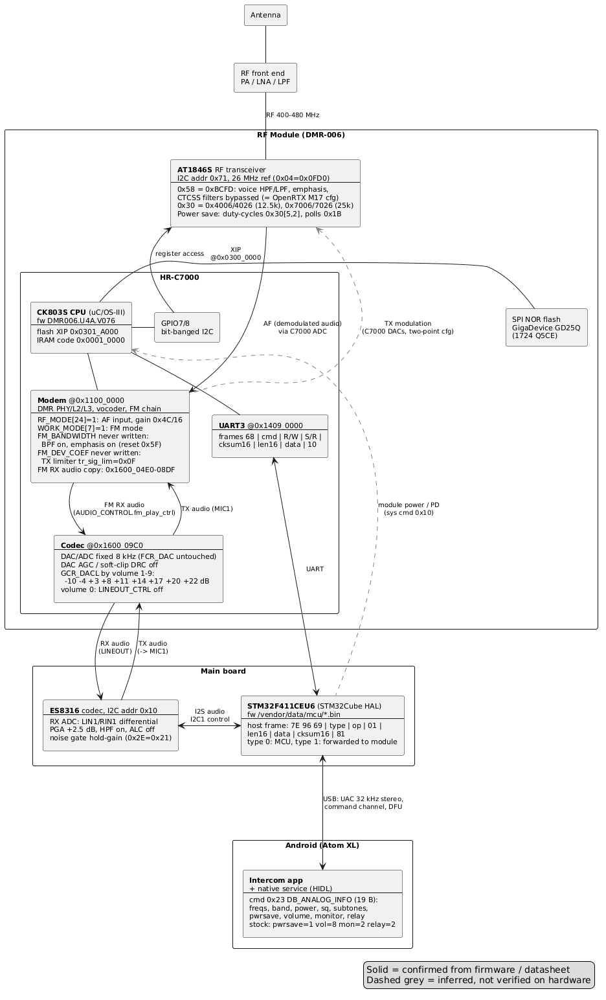
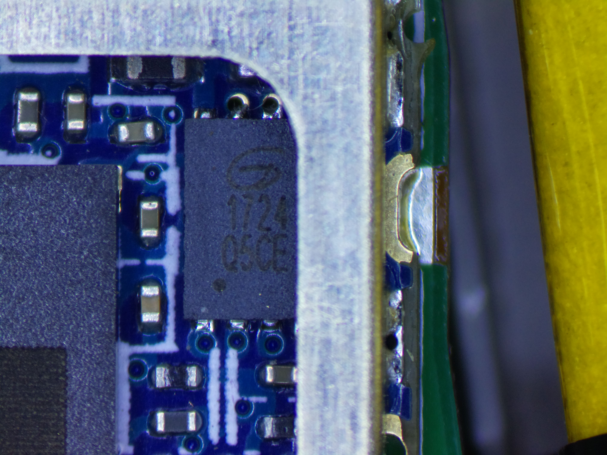

# Unihertz Atom XL - reverse engineering

Goal: make the Atom XL's built-in UHF radio usable for M17.

## Further reading

- [Firmware update paths](./atomxl-re-docs/firmware-update.md): MCU (DFU) and DMR module (YMODEM)
- [DMR module firmware notes](./atomxl-re-docs/dmr-firmware-notes.md): memory map, registers, key functions
- [Ghidra scripts](./atomxl-re-docs/tools/ghidra/): reproduce the analysis

## Block diagram

[PlantUML source](./images/block-diagram.puml). Solid lines are confirmed from firmware or datasheets, dashed lines are inferred.

Signal path: antenna → **AT1846S** transceiver → **HR-C7000** baseband SoC → **ES8316** codec → **STM32F411** → USB → Android.

## Android

- Root with [Magisk](https://topjohnwu.github.io/Magisk/install.html).
- The Intercom app talks to the hardware through a native (HIDL) service. [M17_Intercom](https://github.com/ad1217/M17_Intercom) is an example app that uses it.
- Receive audio reaches the app as USB Audio Class, 32 kHz stereo, read via HIDL `readPcmDevice`.
- Firmware locations:

  |   | Android 10 | Android 11 |
  |---|---|---|
  | MCU firmware | `/system/data/mcu` | `/vendor/data/mcu` |
  | DMR module firmware | `/system/data/dmr` | `/vendor/data/dmr` |

  The DMR module image `DMR006.U4A.V076.bin` is identical in both builds.

## Microcontroller: STM32F411CEU6

Identified from the FCC photos. [Datasheet](https://www.st.com/resource/en/datasheet/stm32f411ce.pdf), [Reference manual](https://www.st.com/resource/en/reference_manual/rm0383-stm32f411xce-advanced-armbased-32bit-mcus-stmicroelectronics.pdf)

- Built with the STM32Cube HAL, version between 1.5.0 and 1.14.0. 1.5.0 adds `HAL_I2S_DMAPause`/`Resume`, which exist in the firmware. 1.15.0 changes `HAL_I2S_Init` so it no longer matches.
- The image is plain and loads at `0x08000000`.
- It bridges USB to the module UART. Host frames (`7E 96 69 ... 81`) with type 1 are re-packed into module frames (`68 ... 10`). See [command-format.md](./command-format.md).
- It configures the ES8316 over I2C1 (address `0x10`) and carries audio over I2S.
- Flashing uses `dfu-util`. The Android service calls `auto_update`, which puts the MCU into DFU mode via `extcmdtest`. On Android 10, `extcmdtest` is in `/system/bin/`.

## Codec: Everest ES8316

[Product brief](./docs/ES8316%20PB.pdf), [User guide with registers](./docs/es8316_user_guide.pdf)

The receive ADC takes differential input on LIN1/RIN1. The STM32 sets it up as follows:

| Register | Value | Effect |
|---|---|---|
| `0x23` | `0x20` | PGA +2.5 dB |
| `0x25` | `0x08` | **ADC high-pass on** (DC blocking, corner frequency undocumented) |
| `0x29` | `0x00` | ALC off |
| `0x2E` | `0x21` | Noise gate in hold-gain mode, harmless with ALC off |

## RF module (DMR-006)

[Product page](http://www.hhttalk.com/en/product_show.asp?pageid=115&big_id=67) (no useful information).

The command set is the ComJot/SunRise DMR09 protocol - see [command-format.md](./command-format.md) and the [ComJot API](./docs/ComJot_API-1.pdf).

### Baseband SoC: HR-C7000 (confirmed)

Dahua HR-C7000: a C-SKY **CK803S** core with a DMR/FM modem, a vocoder and an audio codec. The firmware's memory map and register use match the [HR-C7000 user guide](./docs/HR_C7000_user_guide.pdf) (Chinese, v2.7).

Tooling: [C-SKY Ghidra module](https://github.com/leommxj/ghidra_csky), [C-SKY architecture guide](https://github.com/c-sky/csky-doc/blob/master/CSKY%20Architecture%20user_guide.pdf)

**Loading the firmware in Ghidra.** The image is plaintext but has two segments:

| File offset | Loads at | Contents |
|---|---|---|
| `0x0`-`0x34367` | `0x0301A000` (flash, XIP) | main code |
| `0x34368`-end | `0x00010000` (IRAM) | copied to RAM: RTOS, drivers, AT1846S routines |
| `0x2DF90`, `0x2E60` bytes | `0x18000800` (SRAM) | also copied |

Things to watch for:

- Calls from the RAM section look shifted by `0x0303E368` if it is mapped flat.
- Switch jump tables (`lrw` / `ldr.w (rB,rI<<2)` / `jmp`) aren't resolved automatically.
- The decompiler drops `movih` constants.

**Peripherals used:**

- UART3 (`0x1409_0000`) is the host link.
- The Modem block is at `0x1100_0000`, the codec at `0x1600_09C0`.
- The OS is uC/OS-III.

### RF transceiver: AT1846S

- Controlled over I2C at address `0x71`, bit-banged by the C7000 on GPIO 7/8.
- 26 MHz reference.
- The init script matches OpenRTX's AT1846S driver almost exactly. RDA1846S is register-compatible, but the register `0x58` defaults match the AT1846S.
- Its demodulated AF output feeds a C7000 ADC (AF mode, `RF_MODE[24]=1`).
- Docs: [AT1846S programming guide](https://github.com/OpenRTX/OpenRTX-external-docs/tree/main/Datasheets%20and%20refmans/AT1846S)

### Flash

- GigaDevice SPI NOR, marked `1724 Q5CE`.
- The C7000 executes from it (XIP) at `0x0300_0000`.
- The earlier guess, a GD25LQ05C, is only 64 KB, which is too small. The image is 358 KB and is linked at offset `0x1A000`, so the part must be at least 4 Mbit.

## Receive audio path and M17

The receive chain is: AT1846S → C7000 FM chain → C7000 codec DAC → line-out → ES8316 → STM32 → USB. No AGC, compressor or limiter is active on it, but several stages band-limit the audio:

| Stage | Setting | Effect |
|---|---|---|
| AT1846S register `0x58` | `0xBCFD` | Voice HPF/LPF, emphasis and CTCSS filters all bypassed, the same value OpenRTX uses for M17. Not a problem. |
| C7000 `FM_BANDWIDTH` (`0x1100_0500`) | never written, reset value keeps the band-pass filter and emphasis **on** | Likely a problem |
| C7000 codec DAC | fixed at **8 kHz** | Audio limited to below 4 kHz |
| C7000 codec DAC gain | set by the volume field | Volume 1-9 = -10, -4, +3, +8, +11, +14, +17, +20, +22 dB. The stock value 8 (+20 dB) risks clipping. |
| ES8316 ADC | high-pass on | DC blocking only |

The module sets the AT1846S up on its own, and the host has no raw register access.

**What the host can change today:** fields of the analog channel command `0x23`, or the matching single-field commands:

- `pwrsave` = 2 turns off receive duty-cycling (command `0x31`).
- A lower `volume` reduces the digital gain (command `0x2E`).
- `monitor` = 1 holds the audio path open (command `0x2F`).

**What needs firmware changes:** removing the C7000 band-pass and emphasis, and raising the codec sample rate.
That requires patching the DMR module firmware or writing a replacement.
The firmware never writes to those registers, and no host command exposes them.

## Internal photos

- [Atom XL](./docs/internal-Photo-4760397.pdf) ([source](https://fccid.io/2AK6CATOMXL/Internal-Photos/internal-Photo-4760397.pdf))
- [Atom L](./docs/internal-Photo-4733669.pdf) ([source](https://fccid.io/2AK6CATOML/Internal-Photos/internal-Photo-4733669.pdf)): apparently the same hardware apart from the RF components, with some pads unpopulated.
